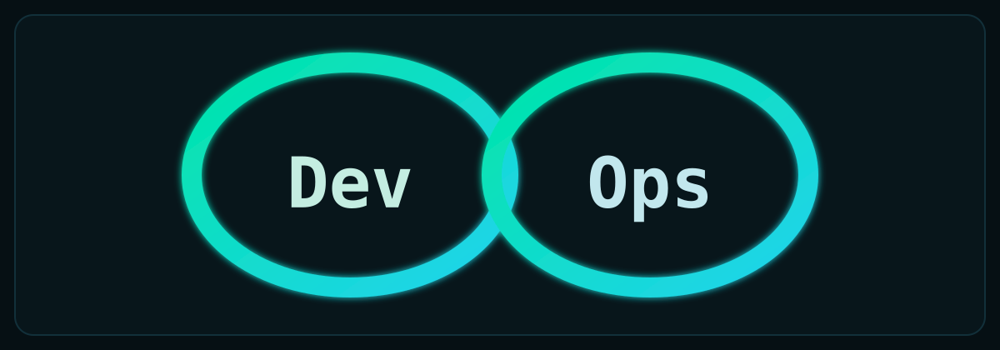

---

## 👤 Bio

**Manish Reddy Nandyala**  
DevOps Engineer (Platform & DevOps Engineer) | San Jose, CA

Platform and DevOps Engineer with 4 years of experience building, deploying, and operating Linux-based, cloud-native systems and data platforms. Strong in Python, Kubernetes, Docker, Linux administration, AWS (EC2/EKS/S3/IAM/CloudWatch), CI/CD (GitHub Actions/Jenkins), observability, and RBAC/security.

## 🧰 Toolbelt

  
  
  
  
  

  
  
  
  
  

## 💼 Experience Highlights

- Built and supported Linux-based data platforms for retail analytics workloads.
- Automated monthly patching and OS upgrades to improve security posture and reliability.
- Containerized Python ingestion and validation services using Docker and Kubernetes.
- Managed Amazon EKS deployments with manifests and Helm, enabling rolling updates with zero downtime.
- Implemented Jenkins CI/CD pipelines for build, test, and container image deployment.
- Set up CloudWatch monitoring, alerting, and centralized logs for faster incident response.
- Enforced RBAC and access policies across AWS and Kubernetes environments.
- Tuned Linux performance and resource utilization to improve service efficiency.

---

## 🔁 DevOps Loop (Animated)

  

