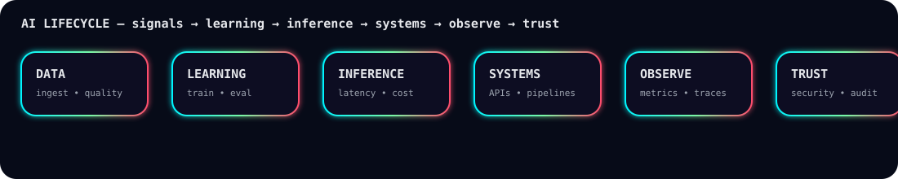
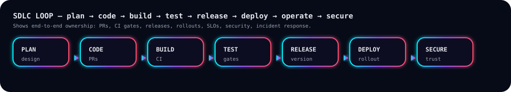

<p align="center">
  
</p>

<p align="center">
  
</p>

<p align="center">
  <a href="https://www.linkedin.com/in/hemanth-kumar-gajagiri-829497233/">
    
  </a>
  <a href="mailto:hemanthkumarg0616@gmail.com">
    
  </a>
  <a href="https://github.com/hemanth2416-byte">
    
  </a>
</p>

---

## 🌌 0X01. THE PROTOCOL
> **"AI is easy to demo. Engineering is making it last — safely."**

I’m a **Full Stack AI Engineer (6+ years)** building production-grade AI systems end-to-end across the SDLC — **design → PRs → CI/CD → deploy → observe → secure**.  
I treat **latency, cost, reliability, and security** as product features, not afterthoughts.

<p align="center">
  
</p>

---

## 🧠 0X02. DELIVERY LOOP (SDLC 2.0)

```text
PR Discipline       → clean diffs, reviews, reproducible environments
CI Gates            → tests + lint + security scan + policy checks
Release Controls    → versioning + changelogs + rollback strategy
Deploy Strategy     → canary/blue-green + safe rollouts
Observability       → metrics/logs/traces + SLOs + alert hygiene
Incident Readiness  → runbooks, postmortems, error budgets
DevSecOps           → secrets, RBAC, encryption, audit trails
```

---

## 🧬 0X03. AI LIFECYCLE (Animated)
<p align="center">
  
</p>

---

## 🛰️ 0X04. SDLC LOOP (Animated)
<p align="center">
  
</p>

---

## 📡 0X05. LIVE TELEMETRY
<p align="center">
  
  
</p>

<p align="center">
  
</p>

<p align="center">
  
</p>

<p align="center">
  <i>AI is easy to demo.<br/>Engineering is making it last — safely.</i>
</p>
